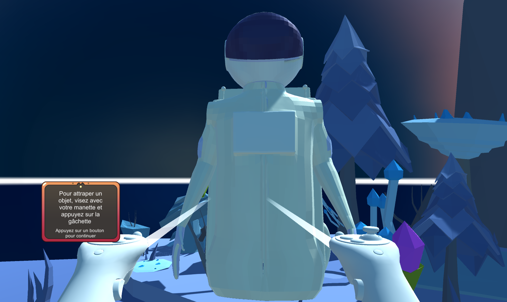
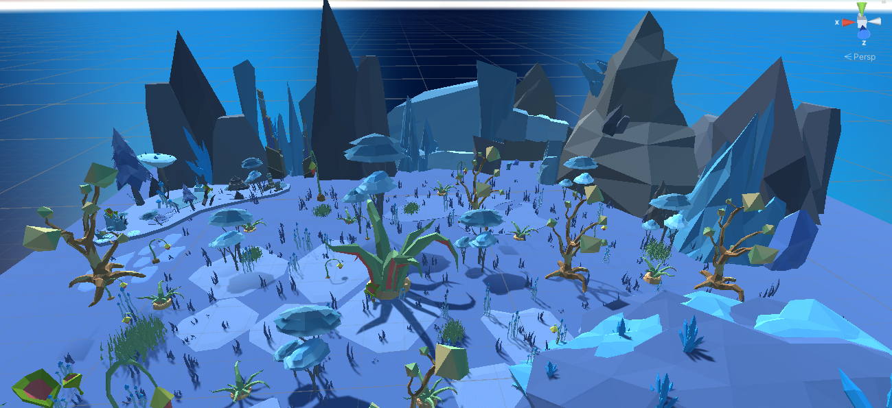

# 🎮 AstroBob 

[](https://forthebadge.com) [](https://www.pixiz.com/template/SWAG-PNG-2119)  []([https://www.pixiz.com/template/SWAG-PNG-2119](https://www.youtube.com/watch?app=desktop&v=kNstaSpMQsE))

Premier projet permettant de découvrir la réalité virtuelle avec Unity !

## 🎥 Aperçu
<p align="center">
  
  
</p>

## 🚀 Fonctionnalités

- 🌍 **Environnement 3D immersif** : Avec votre fidèle compagnon AstroBob, effectuer les quêtes proposées en utilisant les ressources sur la planète.
- 👾 **Interaction avec des objets** : Des objets peuvent être donnés à AstroBob pour valider des quêtes.

## 🛠️ Installation

### Instructions

1. Clonez ce dépôt :
    ```bash
    git clone https://github.com/Makale-Toure/AstroBobVR.git
    ```
2. Importez le projet dans [Unity] en version 2022.3.3f1.
3. Assurez-vous que les dépendances et packages nécessaires soient installés [XR Device Simulator].

## 🎮 Utilisation

1. Configurez votre casque VR.
2. Lancez l’application depuis [nom du logiciel].
3. Utilisez les contrôleurs pour explorer l’univers virtuel.

## 🤖 Technologies/Outils utilisés

- **[Unity]**
- **[Casque VR Occulus Quest 2]**


